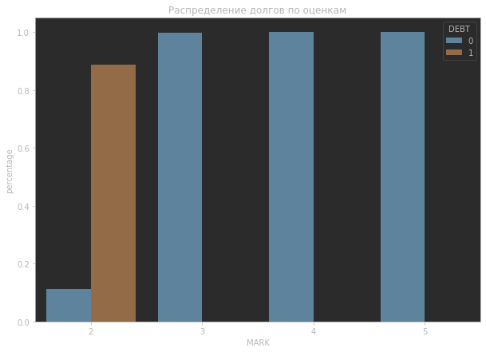
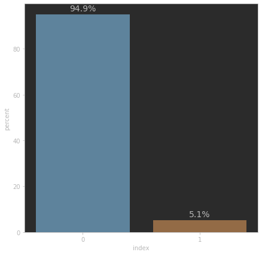
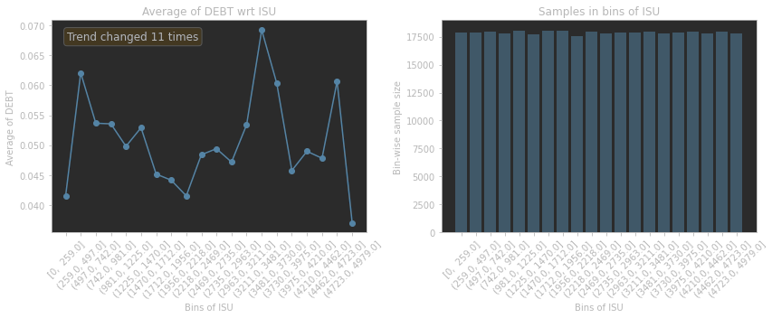
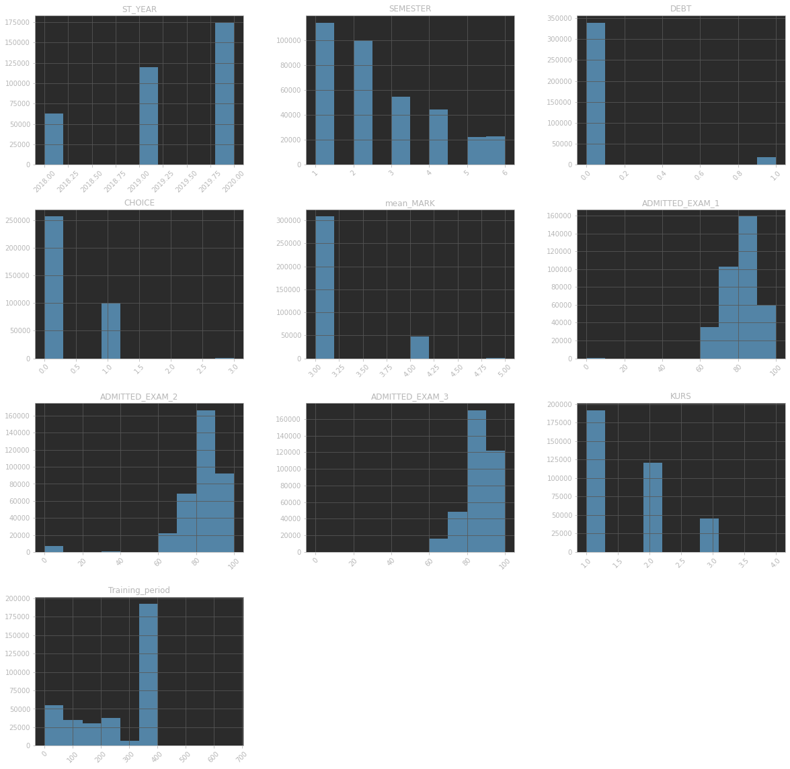
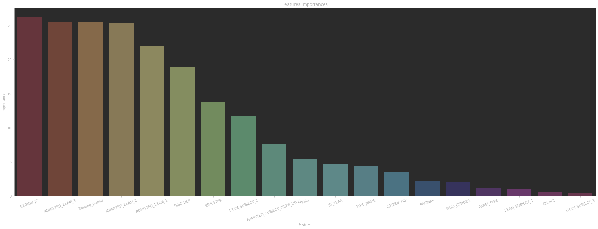

# Learning Analytics
A system that allows predicting academic degrees for students with preschool education.
Team: Voronkina Daria, Zhukov Dmitriy, Kuchuganova Svetlana
## Quick start examples
Clone repo and install [requirements.txt](https://github.com/zhuDmi/Learning_Analitics)
```bash
python3 -m venv env #setup enviroment
source env/bin/activate

git clone https://github.com/zhuDmi/Learning_Analitics  # clone
cd Learning_Analitics
pip install -r requirements.txt  # install
```
## EDA


Classes balance



Checking Target Dependencies on Features



Checking the distribution of numeric values



for more EDA see the [EDA.ipynb](https://github.com/zhuDmi/Learning_Analitics/blob/master/notebooks/EDA.ipynb)

## Choose the models

For compare baselines we are choose 2 models: Catboost and Lightgbm. Base metrics is F1


Hyperparameter fitting done with Optuna


Stacking done. GaussianNB is chosen as the metamodel


## Feature importance



## Model performance

Solution can be reproduced on GPU.

GPU characteristics: Tesla T4.

Time to inference is 0:00:00.758324.
